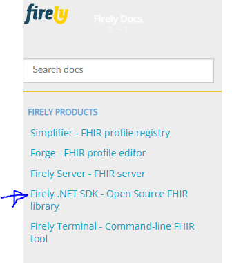

# Testing Firely SDK, Local Run

# Summary
1. FirelyTestApp - CLI App
2. FirelyApiApp - Web App (API)

## Firely Docs Reference

[Firely-NET-SDK](https://docs.fire.ly/projects/Firely-NET-SDK/en/latest/)




__These were build locally using dotnet build:__
```
$ dotnet --list-sdks
8.0.306 [C:\Program Files\dotnet\sdk]
```

# 1. FirelyTestApp - CLI App

## Build

```
$ dotnet new console -n FirelyTestApp 
$ cd FirelyTestApp
```

```
$ dotnet add package Hl7.Fhir.R4
$ dotnet add package Newtonsoft.Json
```

## Run

```
$ dotnet run
```

--- 

# 2. FirelyApiApp - Web App (API)

## Build

```
$ dotnet new webapi -n FirelyApiApp
```

```
$ dotnet add package Hl7.Fhir.R4
```

## Run

```
$ dotnet run
```

Open API (Swagger): http://localhost:5215/swagger/index.html


